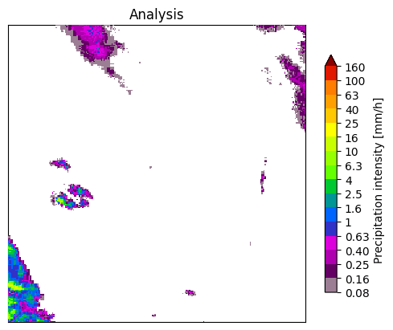

## **pysteps-dgmr-nowcasts**

This is a Python package that provides a deep learning model for performing nowcasting on radar images using the DGMR (Generative Method for Radar) model.

### Features

Implements the state-of-the-art DGMR model for weather nowcasting
Leverages convolutional neural networks (CNNs) and generative adversarial networks (GANs) to produce high-resolution, realistic rainfall forecasts
Supports preprocessing of input frames to match the expected format of the DGMR model
Provides a forecast function to generate rainfall predictions given input frames

### Installation

Install the pysteps-dgmr package using pip:

bash

_pip install pysteps-dgmr-nowcasts_

The package will automatically download the pre-trained DGMR model weights and cache them for future use.

### Usage

_python_
_from pysteps.nowcasts import dgmr_

#### Prepare input frames (4, 256, 256, 1)
input_frames = ...

#### Generate 1 samples of 18 predicted frames
_samples = dgmr.forecast(input_frames, num_samples=1)_

The forecast function takes preprocessed input frames (4, 256, 256, 1) and generates rainfall predictions. It returns a tensor of shape (num_samples, T_out, H, W, C), where T_out is the number of predicted frames (18 or 22, depending on the include_input_frames_in_result parameter).
For more details on the DGMR model and its implementation, please refer to the pysteps documentation.

### Example.
In oder to have an example on how the model works, you can run the _example.py_

### Reference

Ravuri, S., Lenc, K., Willson, M. et al. Skilful precipitation nowcasting using deep generative models of radar. Nature 597, 672–677 (2021).
